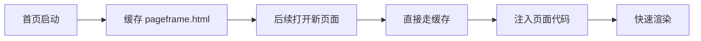
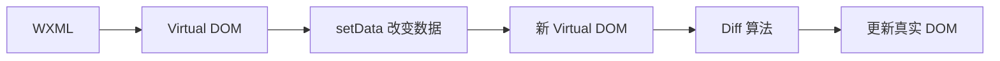
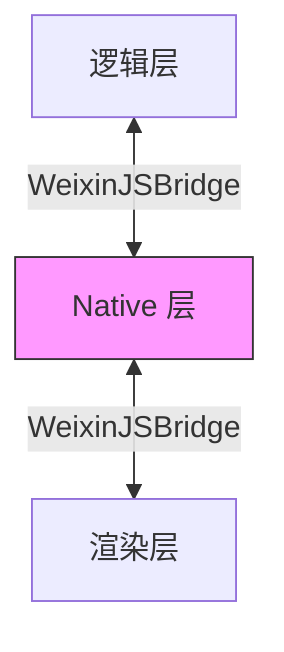
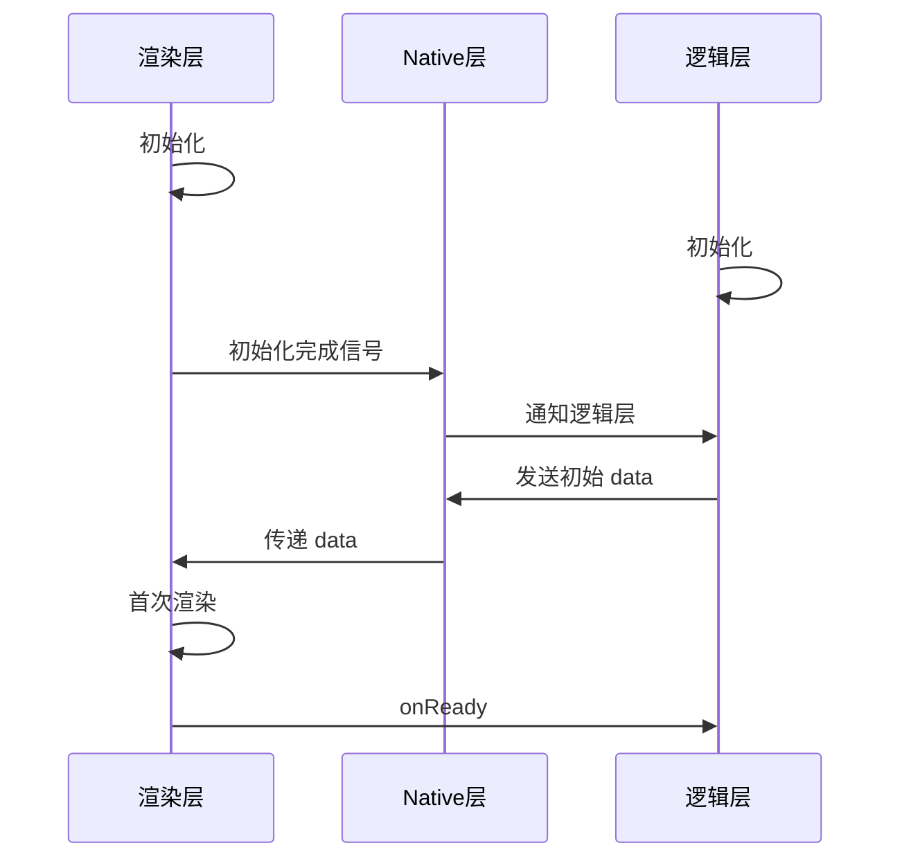
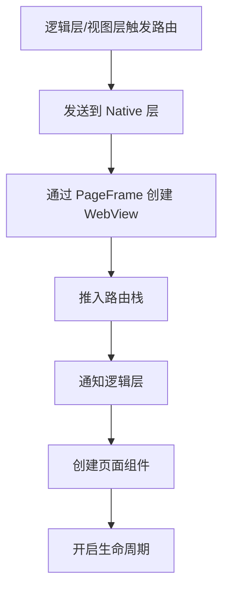
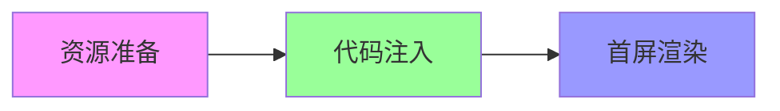

# 微信小程序核心及优化

框架原理 · 兼容问题 · 性能优化

<div class="pt-12">
  <span @click="$slidev.nav.next" class="px-2 py-1 rounded cursor-pointer" hover="bg-white bg-opacity-10">
    开始 <carbon:arrow-right class="inline"/>
  </span>
</div>

<div class="abs-br m-6 flex gap-2">
  <button @click="$slidev.nav.openInEditor()" title="Open in Editor" class="text-xl slidev-icon-btn opacity-50 !border-none !hover:text-white">
    <carbon:edit />
  </button>
</div>


---

# 一、小程序框架原理

理解小程序的底层设计与实现


# 1.1 双线程架构

小程序与传统 Web 单线程架构不同，采用**双线程架构**

<v-clicks>

- **渲染层** - 使用 WebView 进行渲染，一个页面对应一个 WebView
- **逻辑层** - 采用 JSCore 运行 JS 代码
- **通信机制** - 两个线程通过 Native 层（微信客户端）进行转发通信

</v-clicks>


<v-click>

```javascript
// 基本示例
Page({
  onLoad: function () {
    this.setData({ msg: 'Hello World' })
  }
})
```

</v-click>

---

# 为什么使用双线程架构？

<div class="grid grid-cols-2 gap-4">

<div v-click>

### ✅ 优势

1. **管控与安全** 
   - 防止脚本获取修改页面敏感内容
   - 防止随意跳转页面

2. **性能更好**
   - 渲染层和逻辑层并行不阻塞

3. **体验更流畅**
   - 多个 WebView
   - 页面切换接近原生 App

</div>

<div v-click>

### ⚠️ 代价

- 任何数据传递都有延时
- 需要通过 Native 层转发
- 增加通信成本

<div class="mt-8 p-4 bg-blue-100 rounded text-blue-800">
💡 这是微信在管控、性能、体验之间的权衡设计
</div>

</div>

</div>

---

# 1.2 PageFrame 快速渲染设计

<v-clicks>

### WebView 数量限制

- 微信小程序限制最多打开 **10 个页面**
- 达到限制后无法再打开新页面
- **开发建议**：避免路由嵌套太深

### PageFrame 模板预加载机制

小程序启动时会预加载一个空的 WebView 模板（`pageframe.html`）

</v-clicks>

<v-click>

**模板包含的核心 JS 资源：**

<div class="grid grid-cols-2 gap-2 mt-2">

- `wxconfig.js` - 小程序配置项
- `devtoolsconfig.js` - 开发者配置
- `deviceinfo.js` - 设备信息
- `WAWebview.js` - 渲染层底层基础库
- `wxappcode.js` - 页面编译结果

</div>

</v-click>

---

# PageFrame 快速启动原理

<v-click>



</v-click>

<v-click>

### 首次打开新页面流程

```
启动空 WebView 
  ↓
加载 pageframe.html 
  ↓
DOM Ready 
  ↓
history.pushState 修改路径 
  ↓
注入页面代码 
  ↓
渲染完成
```

</v-click>

<v-click>

<div class="mt-4 p-4 bg-green-100 rounded text-green-800">
🚀 这种预加载机制大大提升了页面打开速度
</div>

</v-click>

---

# 1.3 WXML 设计思路 - Exparser 框架

小程序自行搭建了 **Exparser 组件框架**，不依赖浏览器的 WebComponents

<v-clicks>

### 特点

- 基于 Shadow DOM 模型（但不依赖浏览器原生支持）
- 可在纯 JS 环境中运行
- 高效轻量，性能表现好

</v-clicks>

<v-click>

### 组件转换示例

```html
<!-- 源码 -->
<view class="container">
  <text>文本</text>
</view>

<!-- 转换后 -->
<wx-view exparser:info-component-id="2" class="container">
  <wx-text exparser:info-component-id="3">
    <span>文本</span>
  </wx-text>
</wx-view>
```

</v-click>

---

# 原生组件

部分组件由客户端创建，不在 Exparser 渲染体系下

<v-click>

### 原生组件列表

<div class="grid grid-cols-2 gap-2">

- `camera` - 相机
- `canvas` - 画布
- `input` - 输入框（focus 时）
- `textarea` - 文本域
- `video` - 视频
- `map` - 地图
- `live-player` - 直播播放
- `live-pusher` - 直播推流

<div v-click>

### 为什么需要原生组件？

1. **扩展 Web 能力** - 如更好的键盘控制
2. **体验更好** - 减轻 WebView 渲染负担
3. **性能更好** - 绕过 setData 和数据通信

</div>

</div>

</v-click>


---

# 1.4 WXSS 设计思路 - RPX 单位

<v-click>

### rpx（responsive pixel）响应式像素

- 规定屏幕宽为 **750rpx**
- 根据屏幕宽度自适应
- iPhone6: 750rpx = 375px = 750物理像素

</v-click>

<v-click>

### 转换公式

```javascript
// 核心转换公式
px = rpx值 / 750 * 设备宽度
number = Math.floor(number + 0.0001) // 精度收拢
```

</v-click>

<v-click>

### 编译示例

```css
/* 源码 */
.test {
  height: calc(100rpx - 2px);
  width: 200rpx;
}

/* 编译后结构化数据 */
[".", [1], "test{ height: calc(", [0, 100], "-2px); width: ", [0, 200], "; }\n"]
```

</v-click>

---

# 1.5 Virtual DOM 渲染流程

<v-click>

### WXML 编译

WXML 被编译成 `$gwx` 函数，执行后生成 Virtual DOM 树

```javascript
var decodeName = decodeURI("./pages/index/index.wxml")
var generateFunc = $gwx(decodeName)
// 执行 generateFunc() 返回 Virtual DOM 树
```

</v-click>

<v-click>

### 数据驱动原理



</v-click>

<v-click>

<div class="mt-4 p-4 bg-blue-100 rounded text-blue-800">
💡 这和 Vue/React 的原理一致，都是数据驱动视图
</div>

</v-click>

---

# 1.6 事件系统设计

<v-click>

### 事件绑定原理

WXML 中的事件绑定在编译后只是键值对标记，真正的绑定在渲染层完成

</v-click>

<v-click>

```javascript
// WAWebview.js 处理事件
if (n = e.match(/^(capture-)?(mut-)?(bind|catch):?(.+)$/)) {
  // 通过 addListener 绑定事件
  // 触发时通过 sendData 发送到逻辑层
}
```

</v-click>

<v-click>

### 事件流程


</v-click>

---

# 事件类型

<v-clicks>

### 常用事件绑定方式

- **bind** - 事件冒泡
- **catch** - 阻止事件冒泡
- **mut-bind** - 互斥事件（触发后，同级其他 mut-bind 不触发）
- **capture-bind** - 捕获阶段监听
- **capture-catch** - 捕获阶段监听并阻止冒泡

</v-clicks>

<v-click>

```html
<!-- 示例 -->
<view bind:tap="handleTap">冒泡</view>
<view catch:tap="handleTap">阻止冒泡</view>
<view mut-bind:tap="handleTap">互斥</view>
<view capture-bind:tap="handleTap">捕获</view>
```

</v-click>

---

# 1.7 通信系统设计

通过 **WeixinJSBridge** 实现跨线程通信

<v-clicks>

- **iOS** - 利用 WKWebView 的 `messageHandlers` 特性
- **Android** - 向 WebView 的 window 对象注入原生方法

</v-clicks>

<div v-click class="scale-80 -translate-y-3">



</div>

<v-click>

<div class="mt-4 p-4 bg-yellow-100 rounded text-yellow-800 -translate-y-8">
⚠️ Native 层分别在视图层和逻辑层注入 WeixinJSBridge，实现双向通信
</div>

</v-click>

---

# 1.8 生命周期设计

<v-click>

### 页面生命周期

```javascript
Page({
  onLoad(query) {},    // 页面加载，只调用一次
  onShow() {},         // 页面显示/切入前台
  onReady() {},        // 首次渲染完成，只调用一次
  onHide() {},         // 页面隐藏/切入后台
  onUnload() {}        // 页面卸载
})
```

</v-click>

<v-click>

### 与路由的关系

| API | WebView 操作 | 前页生命周期 | 新页生命周期 |
|-----|------------|------------|------------|
| `wx.navigateTo` | 创建新 WebView | onHide | onLoad → onShow → onReady |
| `wx.redirectTo` | 更新当前 WebView | onUnload | onLoad → onShow → onReady |
| `wx.navigateBack` | 销毁 WebView | onUnload | onShow |

</v-click>

---

# 生命周期流程

<div v-click class="scale-60 -translate-y-33">




</div>

---

# 1.9 路由设计

<div v-click class="grid grid-cols-2 gap-4">

<div v-click>

### 路由栈

Native 层维护路由栈，统一控制 WebView 的创建和销毁

</div>

<!-- 缩小一倍 -->
<div v-click class="scale-70 -translate-y-35">


</div>
</div>


<v-click>

<div class="mt-4 p-4 bg-purple-100 rounded">
🎯 路由栈最大深度为 10，需要合理使用 redirectTo 和 navigateBack
</div>

</v-click>

---
layout: center
class: text-center
---

# 二、小程序兼容问题

常见问题及解决方案

---

# 2.1 橡皮筋回弹

<v-click>

### 问题描述

iOS 系统下，滚动到顶部或底部会出现回弹效果，影响用户体验

</v-click>

<v-click>

### 解决方案

```javascript
// 方案1: 使用 scroll-view 组件
<scroll-view scroll-y="true">
  <!-- 内容 -->
</scroll-view>

// 方案2: 禁用页面滚动
// page.json
{
  "disableScroll": true
}
```

</v-click>

---

# 2.2 滚动穿透

<v-click>

### 问题描述

弹窗打开时，背景页面仍可滚动

</v-click>

<v-click>

### 解决方案

```javascript
// 方案1: 动态控制页面滚动
wx.showModal({
  success: () => {
    wx.pageScrollTo({ scrollTop: 0, duration: 0 })
  }
})

// 方案2: 阻止事件冒泡
<view catchtouchmove="preventMove">
  <!-- 弹窗内容 -->
</view>
```

</v-click>

---

# 2.3 安全区域适配

<v-click>

### 问题描述

iPhone X 等全面屏机型需要适配安全区域（刘海屏、底部指示器）

</v-click>

<v-click>

### 解决方案

```javascript
// 获取安全区域信息
const { safeArea, screenHeight } = wx.getSystemInfoSync()
const bottomSafeHeight = screenHeight - safeArea.bottom
```

```css
/* CSS 适配 */
.bottom-bar {
  padding-bottom: env(safe-area-inset-bottom);
}
```

```html
<!-- WebView 内适配 -->
<meta name="viewport" content="width=device-width,initial-scale=1,viewport-fit=cover">
```

</v-click>

---

# 2.4 其他常见兼容问题

<v-clicks>

### WebView 缓存

- 问题：WebView 组件会缓存页面，导致内容不更新
- 解决：URL 添加时间戳 `url + '?t=' + Date.now()`

### scroll-view 自带节流

- 问题：`scrollTop` 值可能不准确
- 解决：使用 `scrolltoupper/scrolltolower` 获取关键数据

### 页面跳转层级限制

- 问题：最大 10 层
- 解决：合理使用 `redirectTo`，重要页面用 TabBar

### WebView 字体过小

- 问题：web-view 加载网页时字体显示异常小
- 解决：设置 viewport meta 标签

</v-clicks>

---

# 2.5 root-portal 全局弹窗

<v-click>

类似 Vue 的 Teleport，将组件渲染到页面根节点

</v-click>

<v-click>

```vue
<template>
  <!-- #ifdef H5 -->
  <teleport to="body">
  <!-- #endif -->
  <!-- #ifdef MP-WEIXIN || MP-ALIPAY -->
  <root-portal>
  <!-- #endif -->
    <slot />
  <!-- #ifdef MP-WEIXIN || MP-ALIPAY -->
  </root-portal>
  <!-- #endif -->
  <!-- #ifdef H5 -->
  </teleport>
  <!-- #endif -->
</template>
```

</v-click>

<v-click>

<div class="mt-4 p-4 bg-blue-100 rounded text-blue-800 ">
💡 适用于全局弹窗、Toast、Loading 等需要脱离当前组件树的场景
</div>

</v-click>

---
layout: center
class: text-center
---

# 三、小程序性能优化

启动优化 · 运行时优化 · 最佳实践

---

# 3.1 小程序启动流程

<v-click>



</v-click>

<v-click>

### 资源准备阶段

1. **小程序信息准备** - 头像、昵称、版本、配置等（缓存）
2. **环境预加载** - 根据场景预加载运行环境（不一定命中）
3. **代码包准备** - 从 CDN 下载代码包（缓存 + 增量更新）

</v-click>

<v-click>

### 微信的优化手段

- 代码包压缩、增量更新
- 优先使用 QUIC 和 HTTP/2
- 预先建立连接、代码包复用（MD5 签名）

</v-click>

---

# 3.2 冷启动优化 - 方法概览

<v-click>

实践证明：合理使用这 4 个方法，冷启动耗时可降低 **70%+** 🚀

</v-click>

<v-clicks>

1. **控制代码包体积** ⭐⭐⭐
   - 分包加载、资源 CDN、组件异步化

2. **代码注入优化** ⭐⭐⭐
   - 按需注入、用时注入、优化主线逻辑

3. **数据预拉取** ⭐⭐⭐
   - 数据预拉取、周期性更新

4. **首屏渲染优化** ⭐⭐⭐
   - 初始渲染缓存、控制渲染优先级、骨架屏

</v-clicks>

---

# 方法1：控制代码包体积


<v-clicks>

1. **使用分包加载**

```json
{
  "pages": ["pages/index/index"],
  "subpackages": [{
    "root": "pages-sub",
    "pages": ["detail/detail"]
  }]
}
```

2. **删除/置空非必要的包**
   - 删除错误打入 `vendor.js` 的包
   - 移出非首屏包到子包

3. **资源文件放 CDN**
   - 字体、图片使用外部链接

4. **组件分包异步化**

</v-clicks>

<v-click>

<div class="mt-4 p-4 bg-green-100 rounded">
✅ 效果：代码包体积减少 ~50%，启动耗时从 554ms → 332ms
</div>

</v-click>

---

# 方法2：代码注入优化

<v-click>

### 1) 启用按需注入

```json
{
  "lazyCodeLoading": "requiredComponents"
}
```

</v-click>

<v-click>

### 2) 启用用时注入（占位组件）

```json
{
  "usingComponents": {
    "heavy-component": "/components/heavy/heavy"
  },
  "componentPlaceholder": {
    "heavy-component": "view"
  }
}
```

</v-click>

<v-click>

### 3) 优化主线逻辑

- 减少阻塞 API（如 Sync 结尾的 API）
- 使用异步 API：`getSystemInfoAsync`
- 简化首屏逻辑，延迟到首屏后执行

</v-click>

---

# 方法3：数据预拉取

<div class="grid grid-cols-2 gap-4">

<div v-click>

#### 数据预拉取（Pre-fetch）

在小程序启动前，通过微信后台提前拉取业务数据


<!-- // app.js
App({
  onLaunch() {
    wx.getBackgroundFetchData({
      fetchType: 'pre',
      success(res) {
        console.log(res.fetchedData)
      }
    })
  }
}) -->

</div>

<div v-click>

#### 周期性更新（Periodic）

在用户未打开小程序时也能更新数据

<!-- // app.js
App({
  onLaunch() {
    wx.getBackgroundFetchData({
      fetchType: 'periodic',
      success(res) {
        console.log(res.fetchedData)
      }
    })
  }
}) -->

</div>

</div>

<v-click>

**对比：**

| 特性 | 数据预拉取 | 周期性更新 |
|------|----------|----------|
| 触发时机 | 小程序启动时 | 定期后台更新 |
| 是否需要打开小程序 | 是 | 否 |
| 使用场景 | 冷启动优化 | 内容预加载 |

</v-click>

---

# 方法4：首屏渲染优化

<v-click>

### 1) 启用初始渲染缓存

```json
{
  "initialRenderingCache": "static"
}
```

视图层不等待逻辑层初始化，直接展示缓存的初始 data

</v-click>

<v-click>

### 2) 控制渲染优先级

- **P0**（首屏必需）：纯静态内容，一次渲染成功
- **P1**（首屏可延迟）：必要数据（预拉取 + 控制数量）
- **P2**（非首屏）：其他功能，延迟加载

</v-click>

<v-click>

### 3) 其他优化

- 提前发起数据请求（EventChannel）
- 控制预加载时机（handleWebviewPreload）
- 使用骨架屏提升感知性能

</v-click>

---

# 分包预下载机制

<v-click>

### 背景

用户跳转到分包页面时，仍需等待分包下载，导致页面切换延迟

</v-click>

<v-click>

### 解决方案

在 `app.json` 中配置 `preloadRule`，提前下载分包

```json {3-13}
{
  "subpackages": [/* ... */],
  "preloadRule": {
    "pages/index": {
      "network": "all",
      "packages": ["important"]
    },
    "pages/login": {
      "network": "wifi",
      "packages": ["user-center", "order-list"]
    }
  }
}
```

</v-click>

---

# 分包预下载 - 配置说明及应用

<v-click>

| 字段 | 类型 | 必填 | 说明 |
|------|------|------|------|
| packages | StringArray | 是 | 预下载分包的 root 或 name |
| network | String | 否 | all（不限网络）、wifi（仅wifi下） |

</v-click>

<v-click>


1. **图片密集页面**（相册、商品展示）
   - 建议设置 `"network": "wifi"`

2. **复杂交互页面**（地图、视频）
   - 可设置 `"network": "all"`

3. **业务流程优化**
   - 登录后预下载用户中心、订单列表

</v-click>

<v-click>


</v-click>

---

# 占位组件（Component Placeholder）

<v-click>

### 概念

用于实现自定义组件的**用时注入**（延迟加载）

</v-click>

<v-click>

### 配置方式

```json
{
  "usingComponents": {
    "heavy-chart": "/components/chart/chart",
    "complex-list": "/components/list/list"
  },
  "componentPlaceholder": {
    "heavy-chart": "view",
    "complex-list": "view"
  }
}
```

</v-click>

<v-click>

#### 工作流程

1. 页面初始化时，先渲染占位组件（view）
2. 当真正需要使用组件时，才注入完整代码
3. 替换占位组件，渲染真实组件

</v-click>

---

# 占位组件 - 适用场景

<v-clicks>

### ✅ 适合使用

- 复杂的图表组件（echarts）
- 富文本编辑器
- 复杂的表单组件
- 条件渲染的组件

### ❌ 不适合

- 首屏必须展示的组件
- 代码量很小的简单组件
- 频繁使用的基础组件

</v-clicks>

<v-click>

### 性能对比

- 代码注入时间：800ms → 500ms（减少 37.5%）
- 首屏渲染时间：1200ms → 800ms（减少 33%）

</v-click>

---

# 3.3 运行时性能优化

<v-click>

### 合理使用 setData ⭐⭐⭐

</v-click>

<v-clicks>

**控制频率**
```javascript
// ❌ 不好
for (let i = 0; i < 100; i++) {
  this.setData({ count: i })
}

// ✅ 好
let count = 0
for (let i = 0; i < 100; i++) count = i
this.setData({ count })
```

**控制范围**
```javascript
// ❌ 更新整个数组
this.setData({ list: newList })

// ✅ 只更新变化的项
this.setData({ [`list[${index}].name`]: newName })
```

</v-clicks>

---

# 页面渲染优化

<v-clicks>

### 1) 适当监听 scroll 事件

```javascript
onPageScroll: throttle(function(e) {
  // 处理滚动
}, 100)
```

### 2) 控制 WXML 节点数量和层级

- 单个页面节点数不超过 **16000**
- 避免过深的层级嵌套
- data 层级不要过深

### 3) 使用 IntersectionObserver 监听曝光

```javascript
const observer = wx.createIntersectionObserver()
observer.observe('.item', (res) => {
  if (res.intersectionRatio > 0) {
    // 元素可见，加载内容
  }
})
```

</v-clicks>

---

# 页面切换优化

<v-clicks>

### 1) 避免在 onHide/onUnload 执行耗时操作

```javascript
// ❌ 阻塞页面切换
onUnload() {
  heavyOperation()
}

// ✅ 异步处理
onUnload() {
  setTimeout(() => heavyOperation(), 0)
}
```

### 2) 提前发起数据请求

```javascript
wx.navigateTo({
  url: '/pages/detail/detail',
  success: (res) => {
    fetchDetailData().then(data => {
      res.eventChannel.emit('acceptData', data)
    })
  }
})
```

</v-clicks>

---

# 资源加载与内存优化

<v-click>

### 图片优化

- 使用合适尺寸和格式（WebP）
- 长列表图片懒加载
- 使用 `<image lazy-load>`

</v-click>

<v-click>

### 内存优化

```javascript
onUnload() {
  // 清理定时器
  clearInterval(this.timer)
  
  // 解绑事件监听
  this.observer && this.observer.disconnect()
}
```

</v-click>

<v-click>

### 合理分包

- 既能减少耗时，也能降低内存占用
- 按需加载，减少运行时内存压力

</v-click>

---

# 小程序更新机制

<v-click>

```javascript
const updateManager = wx.getUpdateManager()

updateManager.onUpdateReady(() => {
  wx.showModal({
    title: '更新提示',
    content: '新版本已准备好，是否重启应用？',
    success: (res) => {
      if (res.confirm) {
        updateManager.applyUpdate()
      }
    }
  })
})

updateManager.onUpdateFailed(() => {
  // 新版本下载失败
  console.log('更新失败')
})
```

</v-click>

<v-click>

<div class="mt-4 p-4 bg-yellow-100 rounded text-yellow-800">
⚠️ 建议在 App.onLaunch 中检查更新，确保用户使用最新版本
</div>

</v-click>

---
layout: center
class: text-center
---

# 小程序为什么快？

相比普通 H5 的优势

---

### 🚀 小程序 vs H5 ==> 小程序优势

<div class="grid grid-cols-2 gap-4">

<div v-click>


1. **双线程架构**
   - 渲染层和逻辑层并行不阻塞

2. **多个 WebView**
   - 页面切换更流畅
   - 体验接近原生

3. **WebView 预加载**
   - PageFrame 模板机制
   - 快速创建页面

4. **安装包缓存**
   - 本地缓存 + 增量更新
   - Code Caching 技术

</div>

<div v-click>

5. **环境预加载**
   - 根据场景提前准备运行环境

6. **原生组件**
   - 关键组件由客户端渲染
   - 性能更好

7. **微信优化**
   - QUIC、HTTP/2
   - 预连接、MD5 复用
   - 大量底层优化

<div class="mt-4 p-4 bg-yellow-100 rounded text-yellow-800">
✅ 这些优化让小程序体验接近原生 App
</div>

</div>

</div>

---

# 开发实践建议

<div class="grid grid-cols-2 gap-4">

<div v-click>

### 架构设计

- ✅ 合理使用分包
- ✅ 首包体积控制在 2MB 以内
- ✅ 避免路由嵌套超过 10 层
- ✅ 重要页面使用 TabBar

### 代码规范

- ✅ 按需注入 + 用时注入
- ✅ setData 控制频率、范围、内容
- ✅ 避免 data 层级过深
- ✅ 及时清理定时器和监听

</div>

<div v-click>

### 资源管理

- ✅ 静态资源使用 CDN
- ✅ 图片懒加载 + WebP 格式
- ✅ 避免 base64 内联大图

### 性能监控

- ✅ 使用开发者工具性能面板
- ✅ 监控启动耗时、渲染耗时
- ✅ 使用 `wx.reportPerformance`

</div>

</div>

---

# 核心知识点总结

<v-clicks>

### 框架原理

- 双线程架构（渲染层 + 逻辑层）
- PageFrame 预加载机制
- Exparser 组件框架
- Virtual DOM 数据驱动
- WeixinJSBridge 通信

### 兼容问题

- 橡皮筋回弹、滚动穿透
- 安全区域适配
- WebView 缓存处理
- root-portal 全局弹窗

</v-clicks>

---

# 核心知识点总结（续）

<v-clicks>

### 性能优化

**冷启动优化（4 大方法）**
1. 控制代码包体积（分包、CDN、异步化）
2. 代码注入优化（按需注入、用时注入）
3. 数据预拉取（Pre-fetch、Periodic）
4. 首屏渲染优化（缓存、优先级、骨架屏）

**运行时优化**
- 合理使用 setData
- 页面渲染优化
- 页面切换优化
- 资源加载与内存优化

</v-clicks>

---

# 优化效果数据

<div class="grid grid-cols-2 gap-8 mt-8">

<div v-click>

### 冷启动优化

```
代码包体积: -50%
  554ms → 332ms

代码注入: -37.5%
  800ms → 500ms

首屏渲染: -33%
  1200ms → 800ms

总体优化: -70%+
```

</div>

<div v-click>

### 运行时优化

```
setData 优化
  减少 80% 通信次数

页面节点优化
  < 16000 个节点
  渲染流畅不卡顿

图片懒加载
  首屏加载 -60%

内存占用
  合理分包 -40%
```

</div>

</div>


---
layout: center
class: text-center
---

# Thanks for Listening!


<div class="mt-12">
  <span class="text-6xl">🚀</span>
</div>

<style>
h1 {
  background-color: #2B90B6;
  background-image: linear-gradient(45deg, #4EC5D4 10%, #146b8c 20%);
  background-size: 100%;
  -webkit-background-clip: text;
  -moz-background-clip: text;
  -webkit-text-fill-color: transparent;
  -moz-text-fill-color: transparent;
}
</style>
